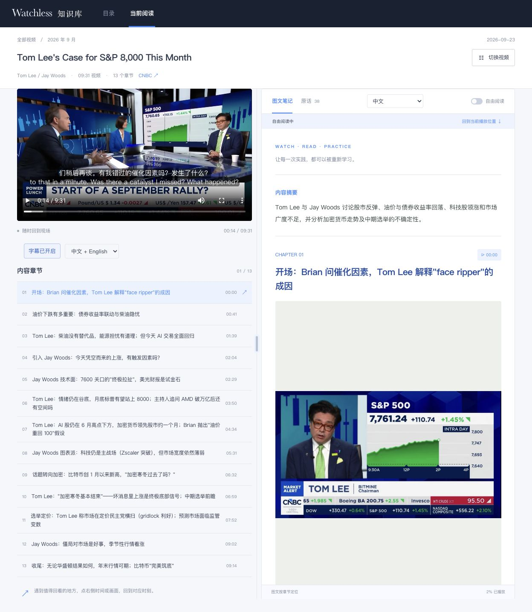
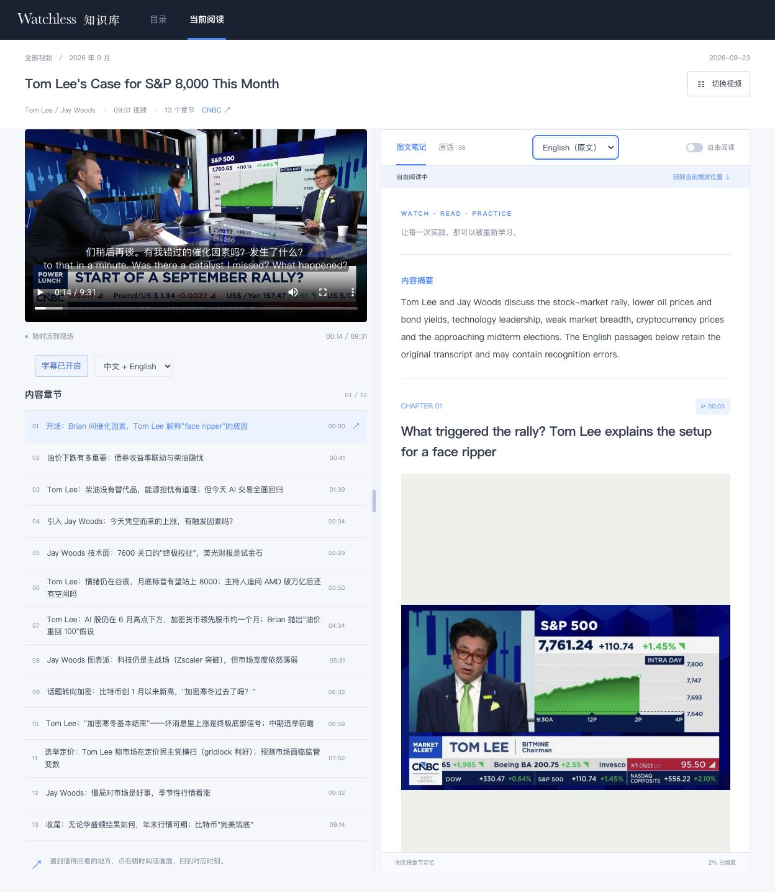
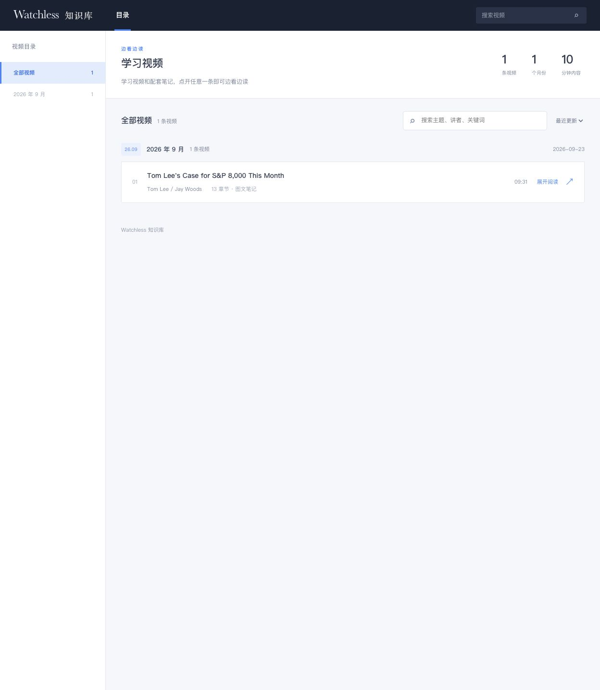

<div align="center">

# Watchless Library

### 把视频变成可阅读、可回看、持续积累的知识库。

给 AI 一个视频链接或本地文件，得到一页「边看边读」的学习笔记。<br>
再给它一个视频，你的知识库就多一条内容。

**视频与笔记联动 · 关键画面 · 中英阅读 · 持续入库**

[安装 Skill](#快速开始) · [加入自己的视频](#加入自己的视频) · [工作原理](#工作原理) · [Watchless](https://github.com/chenzixin1/watchless)

</div>

---

## 快速开始

### 1. 一行命令，安装 Skill

已安装 Node.js / npm 后，在终端运行：

```bash
npx skills add chenzixin1/watchless-library --skill watchless-library
```

按提示选择要使用的 AI 编程工具和安装范围。使用 Codex 时，也可以直接全局安装：

```bash
npx skills add chenzixin1/watchless-library --skill watchless-library -g -a codex -y
```

安装方式使用 [Skills CLI](https://github.com/vercel-labs/skills)。私有仓库需要你的 GitHub 账号拥有访问权限，并已配置 Git 身份验证。

### 2. 给 AI 一个视频

安装后，在 AI 工具中选中或调用 `watchless-library`，然后任选一种方式：

**方式一：直接发 YouTube 视频链接**

复制 YouTube 视频的网址，发给 AI 即可，无需自己先下载：

```text
用 watchless-library 处理这个视频：https://www.youtube.com/watch?v=VIDEO_ID
```

**方式二：提供本地视频文件**

在支持附件的工具中添加视频，或直接给出本机文件路径：

```text
用 watchless-library 处理这个视频：/path/to/my-video.mp4
```

如果已经选中这个 Skill，直接发链接或文件即可。Skill 会负责整理章节、关键画面与笔记，并加入知识库；已有课程会保留，无需每次重复说明。YouTube 链接需要能够访问和下载，处理你拥有或已获授权的内容。

首次处理时，让 AI 按 Skill 检查并准备运行环境。安装 Skill 后，仍需完成 Python、视频工具与所选转录服务的配置，详见[加入自己的视频](#加入自己的视频)。

**音频转文字支持腾讯云、火山引擎和本地 Whisper 三种方案。** 可以根据已有账号、音频隐私要求和本机硬件选择，详见[音频转文字：选择适合你的方案](#音频转文字选择适合你的方案)。

**以后只需继续发视频，知识库就会继续积累。**

<details>
<summary><strong>想先看看效果？直接启动仓库内置示例</strong></summary>

仓库已包含一门约 9 分半的示例课程，带 **13 个场景、视频、关键帧、中英文笔记和三种字幕选项**。可以先体验阅读效果，再配置视频处理环境。

需要 Python 3.10+、Git 和 [Git LFS](https://git-lfs.com/)。安装 Git LFS 后运行：

```bash
git lfs install
git clone https://github.com/chenzixin1/watchless-library.git
cd watchless-library
git lfs pull

python3 scripts/serve.py
```

打开 [本地知识库](http://127.0.0.1:8765/) 或 [示例学习页](http://127.0.0.1:8765/lesson.html?id=tom-lee-sp8000)。这些地址在本机启动服务后可用。

**试着做三件事：** 点击一个章节跳转视频；切换图文笔记的中英文；开启双语字幕。

预览服务只监听本机，支持视频按位置读取，拖动进度条时不必先加载完整视频。仅浏览示例无需安装转录依赖或配置 ASR 密钥。

</details>

## 看一眼，了解它能做什么

### 01 · 左边看视频，右边读笔记

章节、关键画面和文字放在一起。先读笔记找到感兴趣的内容，点击段落或时间码，就能回到视频里的对应位置。



### 02 · 英文视频，也能用中文理解

笔记可切换 **中文 / English（原文）**；播放器可选择 **英文、中文或双语字幕**。适合先用中文理解，再对照英文原话回看。



*截图来自仓库内置示例。新视频需要在处理时准备对应翻译与字幕，页面展示已有语言版本。*

### 03 · 下一段视频，继续放进同一个知识库

处理好的视频会加入目录，按月份整理，也可以搜索查找。已有课程会保留；同一课程重新处理则更新原记录。



**今天整理一场访谈，明天加入一节课程，慢慢积累成自己的知识库。**

适合整理课程、技术分享、访谈播客、论文讲解和产品演示。学习进度保存在当前浏览器中，下次可以继续观看。

## 加入自己的视频

### 1. 准备处理环境

除 Python 外，处理视频需要 `ffmpeg`、`ffprobe` 和 Chromium/Chrome。运行以下命令安装隔离的 Python 依赖并检查环境：

```bash
python3 scripts/setup_runtime.py
python3 scripts/doctor.py
```

选择下方适合自己的音频转文字方案。云端方案需要配置对应服务凭证，本地 Whisper 需要安装可选依赖并下载模型。

### 2. 让 AI 加载 Skill，然后给它视频

在 WorkBuddy 等支持加载本地 Skill 的 AI 编程工具中，加载 [SKILL.md](SKILL.md)，然后**发 YouTube 链接**或**提供本地视频文件**。两种方式的简短示例见[快速开始](#快速开始)。

如需双语内容，可以补充：

> 同时准备英文原文、中文笔记，以及英文、中文和双语字幕。

AI 会依照 Skill 完成转录、语义分段、关键帧选择、笔记整理和入库。**新视频的双语内容需要在处理时生成；切换按钮展示已有语言版本。**

### 3. 下次继续添加

继续提供新视频即可。网站复用相同布局，新内容加入目录；无需为每段视频重新搭建页面。

## 音频转文字：选择适合你的方案

目前已接入三种转录方案。按自己的账号配置、音频能否上传云端，以及本机算力选择即可。

| 方案 | 适合的情况 | 需要准备 | 如何告诉 AI |
| --- | --- | --- | --- |
| **腾讯云 ASR** | 已有腾讯云服务配置，或需要词级时间戳和说话人分离 | 腾讯云 ASR 凭证；音频发送到云端处理 | 「音频转文字使用腾讯云」 |
| **火山引擎 ASR** | 已有火山引擎语音识别服务配置，希望沿用该服务 | 火山引擎 ASR 凭证；音频发送到云端处理 | 「音频转文字使用火山引擎」 |
| **本地 Whisper** | 希望音频在本机转录，或不想配置云端 ASR 密钥 | 安装 Whisper 并下载模型；运行速度取决于本机硬件 | 「音频转文字使用本地 Whisper」 |

未指定时，当前默认使用腾讯云。选择后按该方案执行，失败时会报告原因，不会自动切换服务。Whisper 默认使用 `small` 模型；本地转录不代表后续 AI 笔记整理也在本机运行。

具体配置见 [内置 Watchless 工作流](dependencies/watchless/SKILL.zh-CN.md)，命令行参数见下方折叠说明。

## 与 Watchless 的关系

[Watchless](https://github.com/chenzixin1/watchless) 提供视频理解与图文文档生成工作流；**Watchless Library 在此基础上提供持续积累的学习网站和视频联动阅读体验。**

本仓库已包含 Watchless、video-use 的依赖源码和网站模板。具体依赖说明见 [第三方声明](THIRD_PARTY_NOTICES.md)。

## 工作原理

```text
视频获取与转录 → 语义分段 → 关键帧选择 → 图文笔记 → 课程入库 → 更新目录
```

内容处理由 AI 工具与脚本配合完成，阅读站点使用静态 HTML、CSS 和 JavaScript。站点本身无需数据库，课程数据和媒体文件保存在本地目录中。

<details>
<summary><strong>命令行用法与仓库结构</strong></summary>

### 准备视频

```bash
python3 scripts/run_watchless.py --cwd "$PWD" \
  "https://www.youtube.com/watch?v=VIDEO_ID" --stage prepare
```

`prepare` 是准备阶段；完整流程还需按 [SKILL.md](SKILL.md) 完成后续场景、选帧和笔记处理。

### 选择音频转文字方案

运行准备阶段时，通过 `--provider` 选择方案：

| 方案 | 参数 |
| --- | --- |
| 腾讯云 | `--provider tencent` |
| 火山引擎 | `--provider volcengine` |
| 本地 Whisper | `--provider whisper` |

### 本地 Whisper 安装示例

先完成运行环境准备，再安装可选 Whisper 依赖：

```bash
python3 scripts/setup_runtime.py --with-whisper

python3 scripts/run_watchless.py --cwd "$PWD" \
  "/path/to/my-video.mp4" --stage prepare --provider whisper
```

默认模型为 `small`。首次运行需要下载模型权重，速度取决于本机硬件；此处音频转录使用本地 Whisper，后续笔记整理仍由你使用的 AI 编程工具完成。

### 将处理结果加入站点

```bash
python3 scripts/ingest.py "/path/to/watchless-project" \
  --site "$PWD/site" \
  --id lesson-id \
  --source "来源" \
  --speaker "讲者" \
  --tags "标签1,标签2"
```

同一 `--id` 重跑会覆盖更新，不会重复添加。目录默认按入库月份分组。

### 仓库结构

| 路径 | 用途 |
| --- | --- |
| `SKILL.md` | AI 工具使用的端到端工作流 |
| `dependencies/` | 内置 Watchless 与 video-use |
| `assets/site-template/` | 统一网站模板 |
| `scripts/` | 环境准备、处理、入库、检查与本地服务 |
| `site/` | 可运行的学习网站与示例课程 |
| `site/data/` | 总目录与每门课程的数据 |
| `site/media/` | 视频、封面、关键帧与可选语言数据 |

新增课程只更新目录、课程数据和对应媒体文件。`index.html`、`lesson.html`、`assets/site.css` 和 `assets/site.js` 作为统一外壳复用。

Figma Astra、Jev 访谈和小 Lin 战争经济这三篇课程的视频文件仅保存在本机，没有提交到仓库。克隆仓库后仍可阅读文章、查看截图和语言数据；如需在站内播放视频，请自行将对应的 `video.mp4` 放入 `site/media/<课程 id>/`，或使用课程页的原视频链接。

</details>

## 使用说明

- **转录与翻译**：可能包含识别或翻译误差，关键内容请回看原视频核对。示例字幕的分句时间为估算，并非逐词校准。
- **本地与云端**：阅读站点在本地运行；使用云端 ASR 时，音频会发送至所配置的服务。涉密素材应使用合适的本地转录方案。
- **学习进度**：保存在当前浏览器中，暂不提供账号或跨设备同步。
- **素材授权**：只处理拥有或已获授权的内容。示例包含第三方公开视频素材，供学习和工作流验证；公开传播前请确认授权范围。
- **凭证与许可**：仓库不包含 API 密钥、Cookie 或本机配置。Watchless 与 video-use 采用 MIT License，详见 [THIRD_PARTY_NOTICES.md](THIRD_PARTY_NOTICES.md) 及依赖目录内的许可证。

---

**从一段视频开始，慢慢积累成自己的知识库。**
