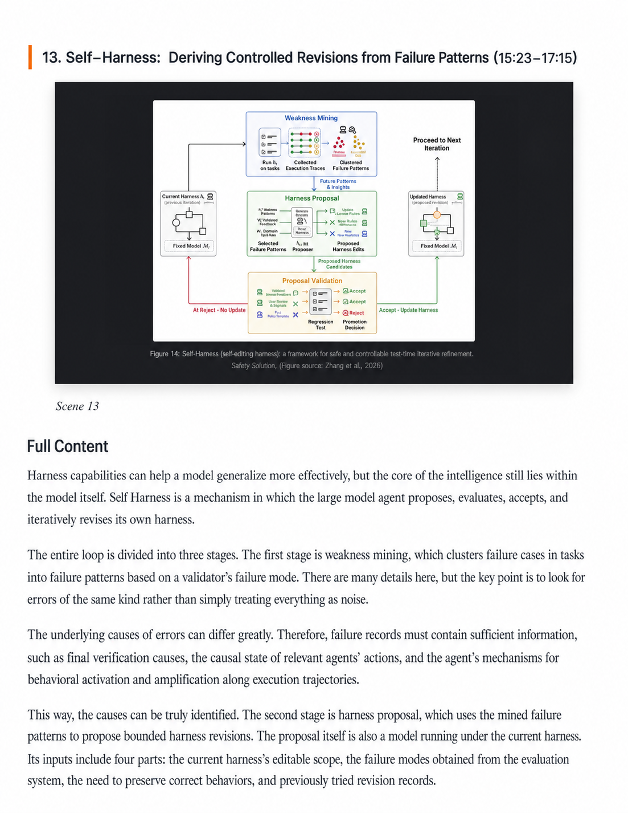
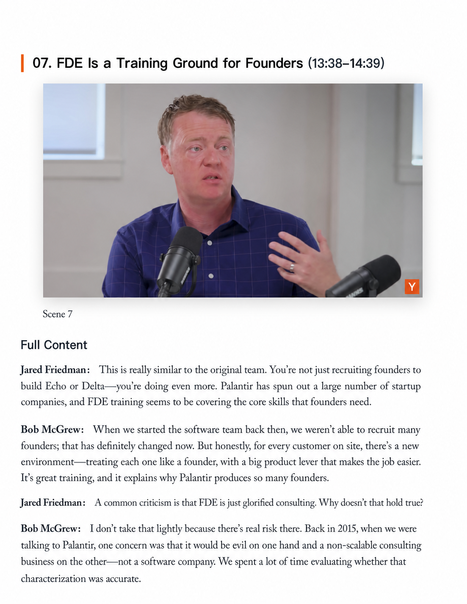
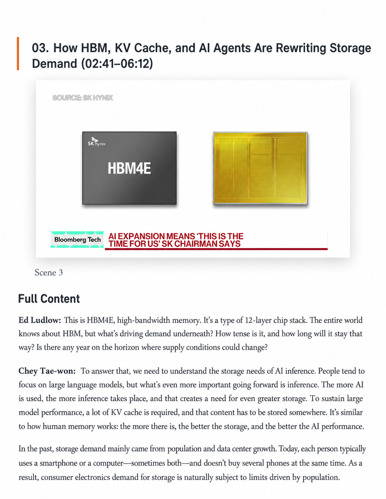
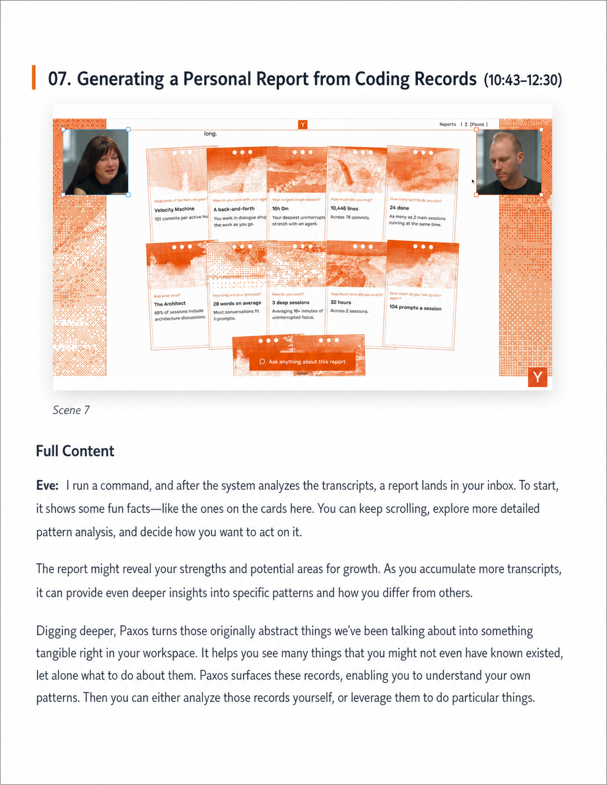
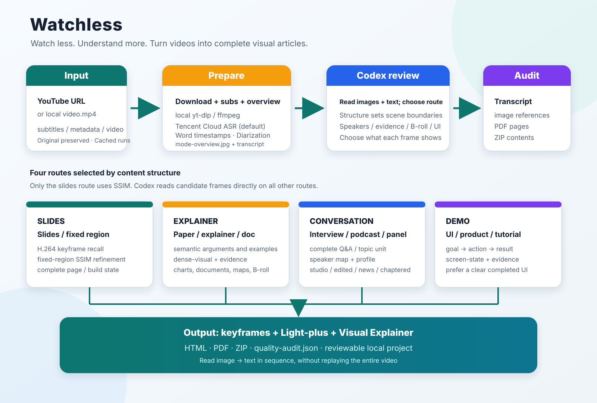

# Watchless

> [English](README.en.md) | [简体中文](README.md)

> **Watch less. Understand more.**


Watchless is a complete video-understanding Skill that runs locally in Codex. It turns a YouTube URL or a local video into a readable document with keyframes, complete written commentary, HTML, PDF, and a shareable ZIP.

The goal is not to generate a summary. Readers should be able to understand a source video's arguments, examples, figures, questions and answers, and visual evidence in order through paired key images and text.

> **Private, internal use only.** This repository retains a local Chrome-cookie fallback, but cookies do not grant a right to download, copy, or distribute content. Process only content you own or are authorized to use, and keep outputs private by default. See [LEGAL.en.md](LEGAL.en.md).

## What it looks like

The four pages below are real Watchless outputs. Each content type uses its own semantic segmentation and keyframe strategy, but they all create one continuous reading experience made of key images and complete text.

<table>
  <tr>
    <td width="50%" valign="top">
      <strong>Paper and document explainer</strong><br>
      <code>explainer + document-evidence</code><br><br>
      <br>
      Segment by complete arguments; preserve original paper figures, diagrams, quotations, and key definitions first.<br>
      <a href="https://www.youtube.com/watch?v=z_F0z7wF5XU">View source video</a>
    </td>
    <td width="50%" valign="top">
      <strong>Multi-person studio conversation</strong><br>
      <code>conversation + studio + speaker</code><br><br>
      <br>
      Use complete questions and answers as boundaries, resolve speakers, and limit repetitive people shots.<br>
      <a href="https://www.youtube.com/watch?v=Zyw-YA0k3xo">View source video</a>
    </td>
  </tr>
  <tr>
    <td width="50%" valign="top">
      <strong>News interview and data evidence</strong><br>
      <code>conversation + news + speaker + evidence</code><br><br>
      <br>
      Pair interview dialogue with lower thirds, product images, and data frames to retain reviewable visual evidence.<br>
      <a href="https://www.youtube.com/watch?v=HTmE6ZKZ9sU">View source video</a>
    </td>
    <td width="50%" valign="top">
      <strong>Product and UI demo</strong><br>
      <code>demo + screen-state + evidence</code><br><br>
      <br>
      Segment by operations and resulting states, prioritizing clear and understandable completed interfaces.<br>
      <a href="https://www.youtube.com/watch?v=VbqaL_eHhKY">View source video</a>
    </td>
  </tr>
</table>

Examples show only low-resolution, single-page excerpts and link to their source videos. They do not include complete outputs that could substitute for the original works; third-party images and names belong to their respective owners.

## What the project does

Watchless converts one video into a set of reviewable, shareable content assets:



1. Download the video, subtitles, and YouTube metadata.
2. Create a timestamped transcript with Tencent Cloud word-level ASR and speaker diarization.
3. Inspect a whole-video overview to determine how the video is organized.
4. Segment on semantic boundaries, rather than mechanically every 60 or 90 seconds.
5. Generate candidate frames for each semantic scene; Codex reads the images directly and selects keyframes.
6. Build a speaker map for multi-person videos, retaining confidence and evidence.
7. Produce faithful Light-plus text and scene-by-scene visual commentary.
8. Export HTML, PDF, and ZIP, then audit subtitles, image references, the PDF, and the archive.

## Content routes

Watchless does not reduce videos to three channel labels such as “slides, explainer, podcast.” It selects a route from the way content actually progresses:

| Route | Best for | Segmentation unit | Key visual |
| --- | --- | --- | --- |
| `slides` | Slide decks, courseware, fixed presentation regions | A slide or complete build state | A stable, complete page |
| `explainer` | Scripted explainers, paper walkthroughs, documentary-style explanations | A complete argument, example, or visual function | Charts, documents, animation, maps, B-roll |
| `conversation` | Interviews, podcasts, panels, Q&A | A complete question, answer, or topic unit | Active speaker, two-shot, evidence frame |
| `demo` | UI tutorials, product demos, operating procedures | An action step and observable result | Before/after and completed interface states |

`conversation` also selects one candidate-frame profile:

- `studio`: stable studio or remote conversations with little visual change; reduce repeated people screenshots.
- `edited`: interviews intercut with locations, documents, archival material, or B-roll; improve evidence-frame recall.
- `news`: broadcast interviews; pay attention to lower thirds, tickers, data graphics, and product images.
- `chaptered`: long interviews whose official chapters provide topic hints without cutting through complete answers.
- `general`: backward-compatible behavior when evidence is insufficient for a more specific profile.

See the full sample matrix and route research in [docs/video-pattern-research.md](docs/video-pattern-research.md).

## Visual strategies

Visual strategies are composable with a main route:

| Strategy | Purpose |
| --- | --- |
| `slide-state` | Select a stable, complete slide or build state |
| `speaker` | Preserve the active speaker or a useful multi-person shot |
| `evidence` | Prefer charts, quotations, interfaces, objects, and source material |
| `broll` | Retain locations and archival material in edited interviews |
| `dense-visual` | Increase candidate frames for visually dense explainers |
| `document-evidence` | Prefer papers, article excerpts, tables, and process diagrams |
| `screen-state` | Prefer a clear UI result over cursor movement or transitions |

Only the `slides` route uses visual comparison: it recalls ffmpeg keyframes, then refines a fixed slide region with local SSIM. `explainer`, `conversation`, and `demo` use no OpenCV, SSIM, perceptual hashing, histogram, face, or aesthetic scoring; Codex reads their candidate images directly.

## Install

```bash
git clone https://github.com/chenzixin1/watchless.git
cd watchless

python3 -m venv .venv
.venv/bin/pip install -r scripts/requirements.txt
.venv/bin/pip install -r scripts/requirements-dev.txt
```

System dependencies:

- `ffmpeg` and `ffprobe`
- `yt-dlp`
- Google Chrome, for HTML-to-PDF conversion
- A locally accessible `video-use` Skill, for transcript packing and targeted timeline inspection

Local Whisper is an explicit fallback only; it never silently replaces Tencent Cloud ASR:

```bash
.venv/bin/pip install -r scripts/requirements-whisper.txt
```

Install as a Codex Skill:

```bash
mkdir -p "$HOME/.codex/skills"
ln -sfn "$(pwd)" "$HOME/.codex/skills/watchless"
```

## Configuration and safety

Tencent Cloud word-level ASR with speaker diarization is the default. Both `--provider tencent` and `--provider auto` select Tencent, with no automatic provider fallback.

Set `TENCENTCLOUD_SECRET_ID` / `TENCENTCLOUD_SECRET_KEY`, or store JSON keys `secret_id` / `secret_key` in `~/.config/watchless/tencent.json` outside the repository (mode `0600`). Never put real credentials in command lines or Git.

The channel supports word timestamps, chunked direct uploads and resumable tasks. Diarization labels anonymous speakers in text; it does not export isolated voice tracks. Speaker labels across chunks require review. See [Tencent ASR](references/tencent-asr.md) for details.

Volcengine remains available with explicit `--provider volcengine`. Its configuration can come from:

- The `VOLCENGINE_API_KEY` environment variable
- A local, untracked `scripts/config.py`
- A configuration file referenced by `WATCHLESS_VOLCENGINE_CONFIG`

Never commit real API keys, browser cookies, downloaded videos, raw transcripts, or generated outputs. The project already ignores `outputs/`, virtual environments, logs, and local caches; `scripts/config.example.py` contains placeholders only.

### Private-use and legal limits

- Chrome cookies may be read transiently only from the local browser profile; never export, print, upload, or commit them.
- Do not use this project to bypass DRM, paywalls, membership limits, private access, regional restrictions, CAPTCHAs, or other access controls.
- The default Tencent Cloud ASR sends audio to a third-party service. Confirm authorization before sending confidential or sensitive material; explicitly use local Whisper when appropriate.
- Speaker names require reliable public evidence. When a speaker cannot be verified, retain `Speaker N`; do not perform face or voice biometric identification.
- Before publishing or using material commercially, independently review the platform terms, copyright, privacy, confidentiality, and attribution requirements.

This notice does not make unauthorized use lawful. See [LEGAL.en.md](LEGAL.en.md) for the full risk description, private-use rules, and official references.

The entire workflow runs locally in Codex and does not depend on the PodSum website, MCP, Cloudflare, APIFY, D1, or R2.

## Workflow

### 1. Acquire, transcribe, and inspect the whole video

```bash
.venv/bin/python scripts/00_build_video_notes.py \
  "https://www.youtube.com/watch?v=VIDEO_ID" \
  --stage prepare
```

The command prints `PROJECT_DIR` and generates:

- `verify/mode-overview.jpg`: a whole-video route overview.
- `work/transcript/`: timestamped transcript files.
- `work/video-use/`: transcription material for the semantic timeline.
- `work/acquisition.json`: source, video, subtitle, and metadata index.

Read the overview image and transcript before choosing a route; do not decide from the title or channel name alone.

### 2. Confirm the route

For example, a news interview:

```bash
.venv/bin/python scripts/00_build_video_notes.py \
  --stage route \
  --project-dir "$PROJECT_DIR" \
  --mode conversation \
  --conversation-profile news \
  --visual-strategy speaker \
  --visual-strategy evidence \
  --mode-reason "On-location news interview with lower thirds and a few data graphics"
```

Common routing examples:

| Video style | Recommended parameters |
| --- | --- |
| XiaoLin-style technology or finance explainer | `explainer + dense-visual + evidence` |
| Paper or article walkthrough | `explainer + document-evidence` |
| a16z or YC Lightcone studio podcast | `conversation + studio + speaker` |
| Edited interview such as Silicon Valley 101 | `conversation + edited + evidence + broll` |
| Bloomberg-style news interview | `conversation + news + speaker + evidence` |
| YC Design Review | `demo + screen-state + evidence` |

### 3. Generate scenes and candidate frames

Slide decks use the hybrid keyframe route:

```bash
.venv/bin/python scripts/00_build_video_notes.py \
  --stage scenes \
  --project-dir "$PROJECT_DIR" \
  --mode auto \
  --slide-rect "0.04,0.08,0.72,0.92"
```

Explainers, conversations, and demos first generate a semantic timeline:

```bash
.venv/bin/python scripts/00_build_video_notes.py \
  --stage timeline \
  --project-dir "$PROJECT_DIR" \
  --mode auto
```

Codex reads `work/video-use/takes_packed.md` and `work/timeline/boundary-review.md`, inspects only `T-4s` through `T+4s` around semantic turns, then writes `work/timeline/scene-boundaries.json`:

```bash
.venv/bin/python scripts/00_build_video_notes.py \
  --stage scenes \
  --project-dir "$PROJECT_DIR" \
  --mode auto \
  --boundaries "$PROJECT_DIR/work/timeline/scene-boundaries.json"
```

During the run, show the whole-video overview, boundary evidence, candidate contact sheets, and final keyframe contact sheet.

### 4. Select keyframes, write commentary, and package

```bash
.venv/bin/python scripts/00_build_video_notes.py --stage select --project-dir "$PROJECT_DIR"
.venv/bin/python scripts/00_build_video_notes.py --stage batches --project-dir "$PROJECT_DIR"

# Codex writes work/codex-notes/scene_NNN.md for every scene.
.venv/bin/python scripts/00_build_video_notes.py --stage finalize --project-dir "$PROJECT_DIR"
```

Conversation videos must complete `work/speaker-map.json` before `batches`. Prefer official YouTube descriptions, self-introductions, subtitles, lower thirds, shot handoffs, official show pages, and channel history as evidence. Retain `Speaker N` rather than guessing when evidence is insufficient.

If the runtime exposes real model-token counts, use `--stage usage` to write `work/token-usage.json`. Keep usage unknown when it is unavailable; never estimate or invent costs.

## Output structure

```text
outputs/video-notes/<title>-<video-id>/
├── work/
│   ├── source/                  # Downloaded video, subtitles, YouTube metadata
│   ├── transcript/              # Readable transcript
│   ├── video-use/               # Semantic-timeline input
│   ├── route-decision.json      # Route and visual strategies
│   ├── timeline/                # Chapter hints, boundary evidence, scene boundaries
│   ├── candidates/              # Candidate frames
│   ├── keyframes/               # Final keyframes selected by Codex
│   ├── speaker-map.json         # Conversation speaker map
│   ├── codex-batches/           # Codex batch input
│   ├── codex-notes/             # Complete commentary for each scene
│   ├── token-usage.json         # Real usage only
│   └── scene-manifest.json
├── verify/
│   ├── mode-overview.jpg
│   ├── boundary-timelines/
│   ├── candidate-contact-sheets/
│   ├── selected-keyframes.jpg
│   ├── quality-audit.json
│   ├── quality-audit.md
│   └── pdf-pages-contact-sheet.jpg
└── share/
    ├── *-light-polished.md
    ├── *-visual-explainer.md
    ├── *-visual-explainer.html
    └── *-visual-explainer.pdf
```

The final ZIP sits at the project root and contains only the shareable `share/` content—not videos, credentials, browser state, or logs.

## Quality checks

```bash
.venv/bin/pytest -q
python3 -m compileall -q scripts tests
git diff --check
```

Finalize creates `verify/quality-audit.json` and `verify/quality-audit.md`, which check:

- Whether the transcript has complete coverage in source order.
- Whether the counts of scenes, commentary files, and keyframes match.
- Whether the conversation speaker map is complete.
- Whether HTML references real image files.
- Whether the PDF renders successfully and produces a page overview.
- Whether the ZIP contents are complete.
- Whether byte-identical duplicate keyframes exist.
- Whether real token usage and an explicit rate have been recorded.

## Contributing and sources

Watchless is a local Codex Skill, not a standalone website or online API. When changing processing logic, update:

1. `SKILL.md` and `SKILL.zh-CN.md`.
2. `README.en.md`, `README.md`, and any relevant route-research documentation.
3. Related script tests and quality audits.
4. The workflow diagram so it matches the real processing stages.

Watchless uses `video-use` for transcript packing and targeted timeline inspection. See [THIRD_PARTY_NOTICES.md](THIRD_PARTY_NOTICES.md) for third-party notices.
