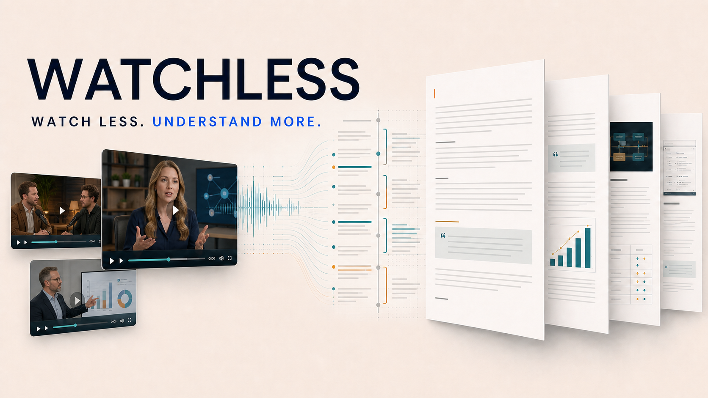
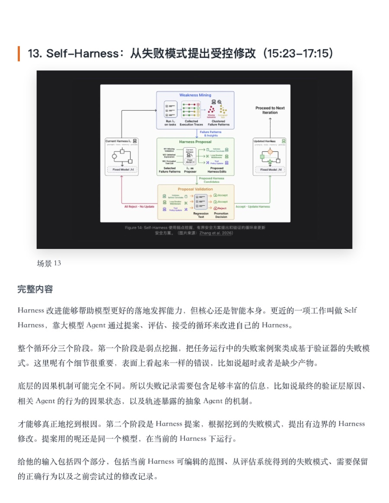
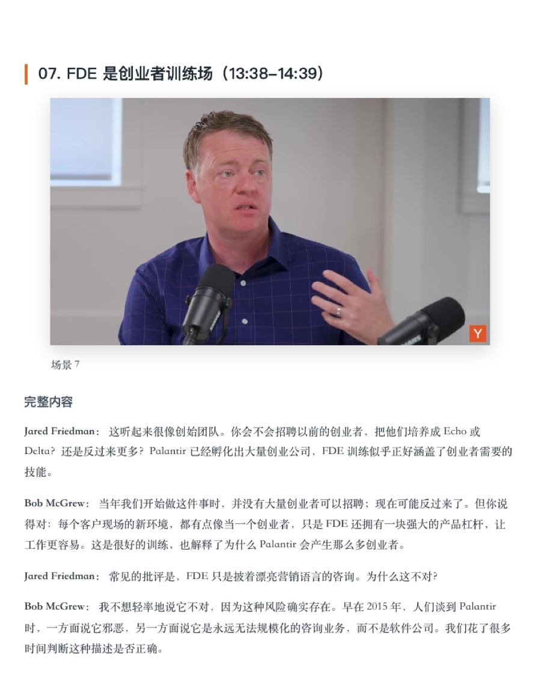
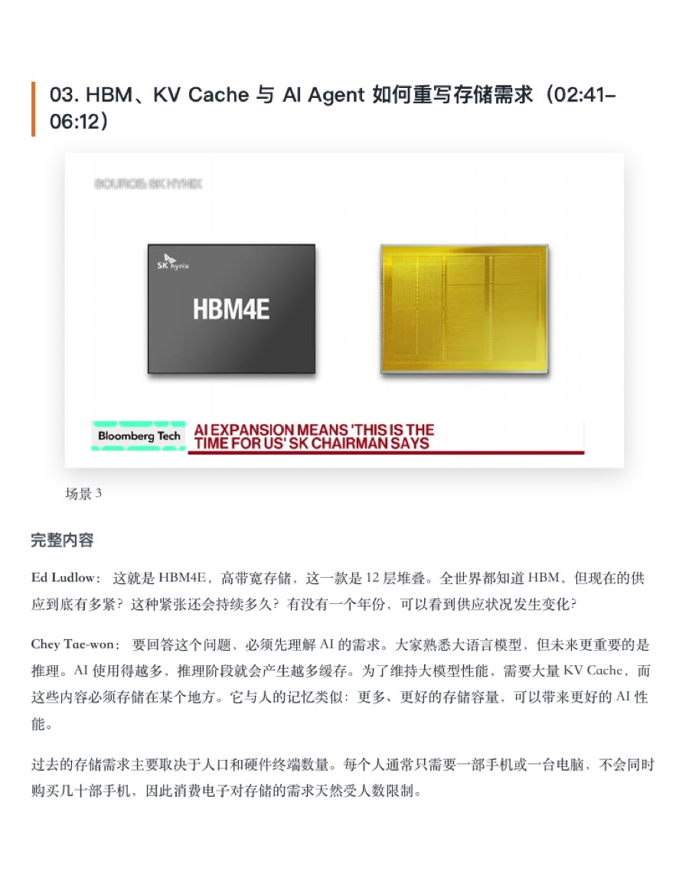
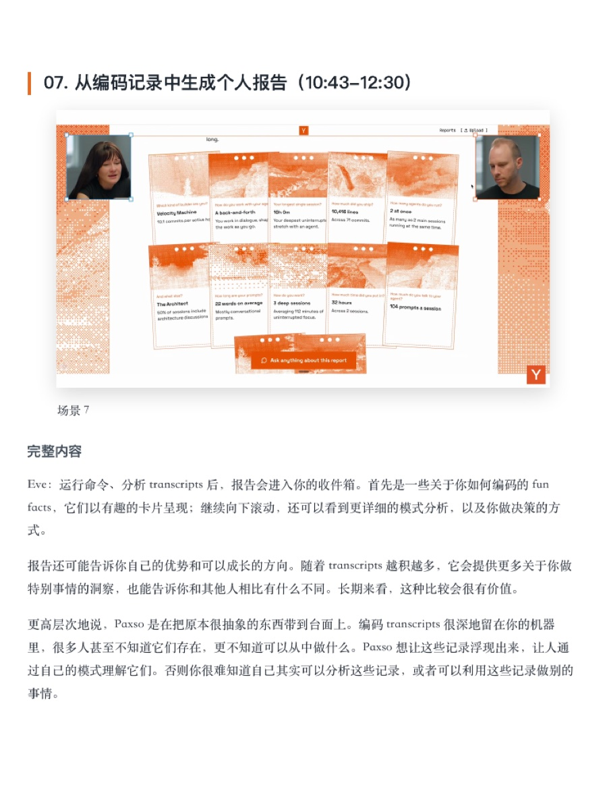
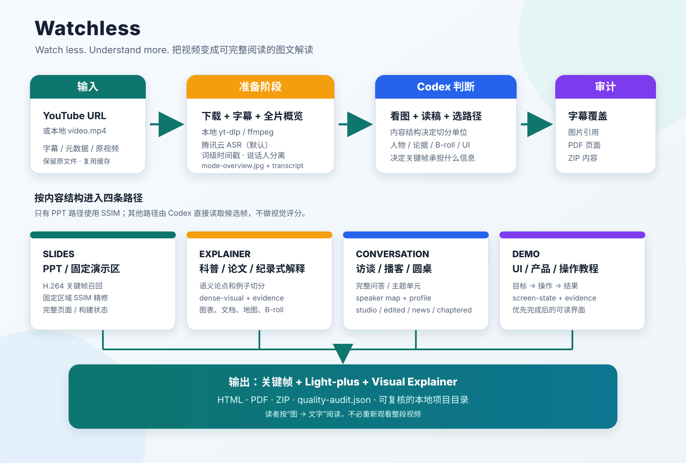

# Watchless

> [简体中文](README.md) | [English](README.en.md)

> **Watch less. Understand more.**



一个在 Codex 本地运行的完整视频理解 Skill：把 YouTube 链接或本地视频，转换成带关键帧、完整文字解说、HTML、PDF 和分享 ZIP 的可读文档。

项目目标不是生成一段摘要，而是让读者通过“关键图 + 对应文字”的顺序，完整理解原视频的论点、例子、数字、问答和视觉证据。

> **私人内部使用。** 本仓库保留本机 Chrome Cookie 回退，但 Cookie 不会赋予下载、复制或传播权。只处理自己拥有或已经获得授权的内容，输出默认保持私人。详见 [LEGAL.md](LEGAL.md)。

## 实际效果

下面四个页面均来自 Watchless 的真实输出。不同内容采用不同的语义切分和关键帧策略，但最终都形成“关键图 + 完整文字”的连续阅读体验。

<table>
  <tr>
    <td width="50%" valign="top">
      <strong>论文与文档解读</strong><br>
      <code>explainer + document-evidence</code><br><br>
      <br>
      围绕完整论点切分，优先保留论文原图、流程图、引文和关键定义。<br>
      <a href="https://www.youtube.com/watch?v=z_F0z7wF5XU">查看原视频</a>
    </td>
    <td width="50%" valign="top">
      <strong>棚内多人对谈</strong><br>
      <code>conversation + studio + speaker</code><br><br>
      <br>
      以完整问题和回答为边界，识别说话人，并控制重复人物画面的密度。<br>
      <a href="https://www.youtube.com/watch?v=Zyw-YA0k3xo">查看原视频</a>
    </td>
  </tr>
  <tr>
    <td width="50%" valign="top">
      <strong>新闻访谈与数据证据</strong><br>
      <code>conversation + news + speaker + evidence</code><br><br>
      <br>
      结合采访问答、姓名条、产品图和数据画面，保留可复核的视觉证据。<br>
      <a href="https://www.youtube.com/watch?v=HTmE6ZKZ9sU">查看原视频</a>
    </td>
    <td width="50%" valign="top">
      <strong>产品与 UI 演示</strong><br>
      <code>demo + screen-state + evidence</code><br><br>
      <br>
      按操作步骤和结果状态切分，优先保留清晰、可理解的完成界面。<br>
      <a href="https://www.youtube.com/watch?v=VbqaL_eHhKY">查看原视频</a>
    </td>
  </tr>
</table>

案例只展示低分辨率单页节选并链接原视频，不包含可替代原作品的完整输出；第三方画面和名称的权利归各自权利人所有。

## 项目做什么

Watchless 将一条视频处理成一套可复核、可分享的内容资产：



1. 下载视频、字幕和 YouTube 元数据。
2. 使用腾讯云词级 ASR 和说话人分离生成带时间戳的转录稿。
3. 查看全片概览，判断视频的内容组织方式。
4. 按语义边界切分，而不是机械地每 60 或 90 秒切一段。
5. 从每个语义场景生成候选帧，由 Codex 直接读取图片并选择关键帧。
6. 对多人视频建立说话人映射，保留可信度和证据。
7. 生成忠实的 Light-plus 文本和逐场景视觉解说。
8. 输出 HTML、PDF、ZIP，并运行字幕、图片引用、PDF 和压缩包审计。

## 内容路径

项目不把视频简单归为“PPT、科普、播客”三类，而是根据内容如何推进来选择路径：

| 路径 | 适合内容 | 切分单位 | 关键画面 |
| --- | --- | --- | --- |
| `slides` | PPT、课程课件、固定演示区 | 幻灯片或完整构建状态 | 稳定的完整页面 |
| `explainer` | 小 Lin 式科普、论文解读、纪录式解释 | 完整论点、例子或视觉功能 | 图表、文档、动画、地图、B-roll |
| `conversation` | 访谈、播客、圆桌、问答 | 完整问题、回答或主题单元 | 当前说话人、双人镜头、资料画面 |
| `demo` | UI 教程、产品演示、操作流程 | 操作步骤和可观察结果 | 操作前后、完成后的界面状态 |

`conversation` 还会选择一个候选帧子类型：

- `studio`：棚内或远程对谈，视觉变化少，减少重复人物截图。
- `edited`：穿插外景、文档、历史资料或 B-roll，提高证据画面召回。
- `news`：新闻采访，关注姓名条、Ticker、数据图和产品图。
- `chaptered`：长访谈，使用官方章节作为主题提示，但不让章节截断完整回答。
- `general`：证据不足时的兼容行为。

详细的样本矩阵和模式研究见 [docs/video-pattern-research.zh-CN.md](docs/video-pattern-research.zh-CN.md)。

## 视觉策略

视觉策略可以叠加在主路径上：

| 策略 | 作用 |
| --- | --- |
| `slide-state` | 选择稳定、完整的幻灯片或构建状态 |
| `speaker` | 保留当前主讲人或有用的多人镜头 |
| `evidence` | 优先图表、引文、界面、物体和资料 |
| `broll` | 保留编辑型采访中的外景和历史材料 |
| `dense-visual` | 为高视觉密度科普增加候选帧 |
| `document-evidence` | 优先论文、文章摘录、表格和流程图 |
| `screen-state` | 优先清晰的界面结果，而不是鼠标移动或转场 |

只有 `slides` 路径使用视觉比较：先用 ffmpeg 关键帧召回，再对固定 PPT 区域做局部 SSIM 精修。`explainer`、`conversation` 和 `demo` 不使用 OpenCV、SSIM、感知哈希、直方图、人脸评分或美学评分，而是由 Codex 直接读取候选图片。

## 安装

```bash
git clone https://github.com/chenzixin1/watchless.git
cd watchless

python3 -m venv .venv
.venv/bin/pip install -r scripts/requirements.txt
.venv/bin/pip install -r scripts/requirements-dev.txt
```

系统依赖：

- `ffmpeg` 和 `ffprobe`
- `yt-dlp`
- Google Chrome，用于 HTML 转 PDF
- 本机可访问的 `video-use` Skill，用于转录打包和局部时间线检查

本地 Whisper 只作为显式回退，不会静默替换腾讯云 ASR：

```bash
.venv/bin/pip install -r scripts/requirements-whisper.txt
```

安装为 Codex Skill：

```bash
mkdir -p "$HOME/.codex/skills"
ln -sfn "$(pwd)" "$HOME/.codex/skills/watchless"
```

## 配置和安全

腾讯云词级 ASR 是默认转录路径，默认启用说话人分离。`--provider tencent` 和 `--provider auto` 均使用腾讯云，失败不会自动切换服务商。

配置环境变量 `TENCENTCLOUD_SECRET_ID` / `TENCENTCLOUD_SECRET_KEY`，或将 `secret_id` / `secret_key` 写入仓库外的 `~/.config/watchless/tencent.json`（文件权限 `0600`）。不要在命令行或 Git 中写入真实密钥。

支持词级时间戳、长音频分段直传和任务续跑。说话人分离是文字中的匿名标签，不输出独立人声音轨；跨分段标签需要人工核验。完整说明见 [腾讯云通道](references/tencent-asr.md)。

火山通道保留，仅在显式 `--provider volcengine` 时使用。火山配置可以来自：

- 环境变量 `VOLCENGINE_API_KEY`
- 本地未纳入 Git 的 `scripts/config.py`
- `WATCHLESS_VOLCENGINE_CONFIG` 指向的配置文件

不要把真实 Key、浏览器 Cookie、下载视频、转录原文或生成产物提交到 Git。项目已经忽略 `outputs/`、虚拟环境、日志和本地缓存；`scripts/config.example.py` 只保留占位符。

### 私人使用与法律边界

- Chrome Cookie 只允许程序从本机浏览器配置临时读取，不得导出、打印、上传或提交。
- 不得使用本项目绕过 DRM、付费墙、会员限制、私人访问、地区限制、验证码或其他访问控制。
- 默认腾讯云 ASR 会把音频发送给第三方服务；保密或敏感内容必须先确认授权，必要时显式改用本地 Whisper。
- 说话人名称必须有可靠公开证据，无法确认时保留 `说话人N`，不得进行人脸或声纹生物识别。
- 公开发布或商业使用前必须另行核对平台条款、版权、隐私、保密和署名要求。

免责声明不能把未经授权的使用变成合法。完整风险说明、私人使用规则和官方参考见 [LEGAL.md](LEGAL.md)。

整个流程在 Codex 本地运行，不依赖 PodSum 网站、MCP、Cloudflare、APIFY、D1 或 R2。

## 使用流程

### 1. 下载、转录和全片概览

```bash
.venv/bin/python scripts/00_build_video_notes.py \
  "https://www.youtube.com/watch?v=VIDEO_ID" \
  --stage prepare
```

命令会打印 `PROJECT_DIR`，并生成：

- `verify/mode-overview.jpg`：全片模式概览。
- `work/transcript/`：带时间戳的转录稿。
- `work/video-use/`：供语义时间线使用的转录材料。
- `work/acquisition.json`：来源、视频、字幕和元数据索引。

先直接查看概览图和转录稿，再确定路径；不能只根据标题或频道名称判断。

### 2. 确认路径

例如，新闻访谈：

```bash
.venv/bin/python scripts/00_build_video_notes.py \
  --stage route \
  --project-dir "$PROJECT_DIR" \
  --mode conversation \
  --conversation-profile news \
  --visual-strategy speaker \
  --visual-strategy evidence \
  --mode-reason "现场新闻采访，包含姓名条和少量数据图"
```

常用路由示例：

| 视频样式 | 推荐参数 |
| --- | --- |
| 小 Lin 式科技/财经科普 | `explainer + dense-visual + evidence` |
| 论文或文章讲解 | `explainer + document-evidence` |
| a16z、YC Lightcone 棚内播客 | `conversation + studio + speaker` |
| 硅谷 101 等编辑型采访 | `conversation + edited + evidence + broll` |
| Bloomberg 式新闻采访 | `conversation + news + speaker + evidence` |
| YC Design Review | `demo + screen-state + evidence` |

### 3. 生成场景和候选帧

PPT 使用混合关键帧路径：

```bash
.venv/bin/python scripts/00_build_video_notes.py \
  --stage scenes \
  --project-dir "$PROJECT_DIR" \
  --mode auto \
  --slide-rect "0.04,0.08,0.72,0.92"
```

科普、对谈和演示先生成语义时间线：

```bash
.venv/bin/python scripts/00_build_video_notes.py \
  --stage timeline \
  --project-dir "$PROJECT_DIR" \
  --mode auto
```

Codex 读取 `work/video-use/takes_packed.md` 和 `work/timeline/boundary-review.md`，只在语义转折点附近检查 `T-4s` 到 `T+4s`，然后写入 `work/timeline/scene-boundaries.json`：

```bash
.venv/bin/python scripts/00_build_video_notes.py \
  --stage scenes \
  --project-dir "$PROJECT_DIR" \
  --mode auto \
  --boundaries "$PROJECT_DIR/work/timeline/scene-boundaries.json"
```

运行过程中应展示全片概览、边界证据、候选接触表和最终关键帧接触表。

### 4. 选择关键帧、生成解说和打包

```bash
.venv/bin/python scripts/00_build_video_notes.py --stage select --project-dir "$PROJECT_DIR"
.venv/bin/python scripts/00_build_video_notes.py --stage batches --project-dir "$PROJECT_DIR"

# Codex 逐场景写入 work/codex-notes/scene_NNN.md
.venv/bin/python scripts/00_build_video_notes.py --stage finalize --project-dir "$PROJECT_DIR"
```

对谈视频必须在 `batches` 之前完成 `work/speaker-map.json`。说话人证据优先使用 YouTube 官方简介、自我介绍、字幕、姓名条、镜头交接、官方节目页和频道历史；证据不足时保留 `说话人N`，不能强行猜名。

如果运行时暴露了真实模型 Token 数量，使用 `--stage usage` 写入 `work/token-usage.json`。没有真实用量时保持未知，不估算、不伪造费用。

## 输出结构

```text
outputs/video-notes/<title>-<video-id>/
├── work/
│   ├── source/                  # 下载的视频、字幕、YouTube 元数据
│   ├── transcript/              # 可读转录稿
│   ├── video-use/               # 语义时间线输入
│   ├── route-decision.json      # 路径和视觉策略
│   ├── timeline/                # 章节提示、边界证据、场景边界
│   ├── candidates/              # 候选帧
│   ├── keyframes/               # Codex 选择的最终关键帧
│   ├── speaker-map.json         # 对谈说话人映射
│   ├── codex-batches/           # Codex 批次输入
│   ├── codex-notes/             # 每个场景的完整解说
│   ├── token-usage.json         # 仅记录真实用量
│   └── scene-manifest.json
├── verify/
│   ├── mode-overview.jpg
│   ├── boundary-timelines/
│   ├── candidate-contact-sheets/
│   ├── selected-keyframes.jpg
│   ├── quality-audit.json
│   ├── quality-audit.md
│   └── pdf-pages-contact-sheet.jpg
└── share/
    ├── *-light-polished.md
    ├── *-visual-explainer.md
    ├── *-visual-explainer.html
    └── *-visual-explainer.pdf
```

最终 ZIP 位于项目目录根部，只包含可分享的 `share/` 内容，不包含视频、凭据、浏览器状态或日志。

## 质量验证

```bash
.venv/bin/pytest -q
python3 -m compileall -q scripts tests
git diff --check
```

Finalize 会生成 `verify/quality-audit.json` 和 `verify/quality-audit.md`，检查：

- 转录是否按原顺序完整覆盖。
- 场景、解说和关键帧数量是否一致。
- 对谈说话人映射是否完成。
- HTML 是否引用了实际存在的图片。
- PDF 是否成功渲染并生成页面概览。
- ZIP 内容是否完整。
- 是否存在字节级重复关键帧。
- 是否记录了真实 Token 用量和显式费率。

## 贡献和来源

这是一个面向 Codex 的本地 Skill，不是独立网站或在线 API。修改处理逻辑时，请同步更新：

1. `SKILL.md` 和 `SKILL.zh-CN.md`。
2. `README.md` 和必要的模式研究文档。
3. 对应脚本测试和质量审计。
4. 项目流程图中的真实处理阶段。

Watchless 使用 `video-use` 完成转录打包和局部时间线检查；第三方说明见 [THIRD_PARTY_NOTICES.md](THIRD_PARTY_NOTICES.md)。
